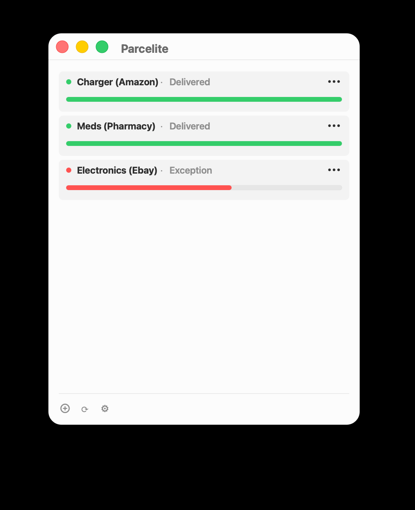
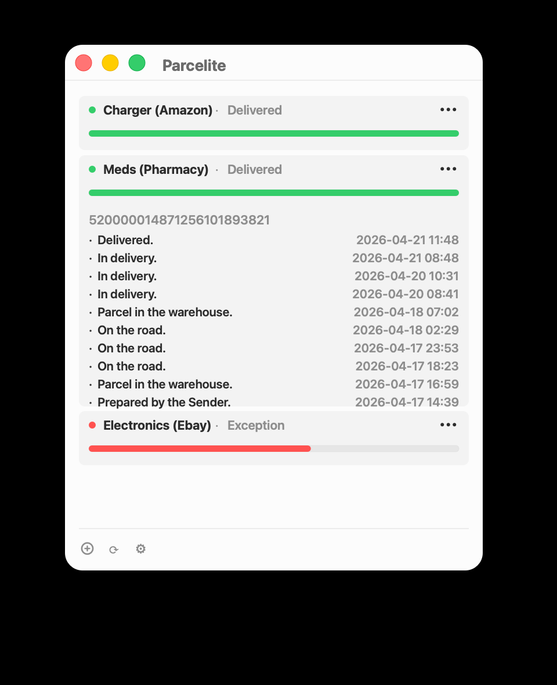

# Parcelite


Parcelite is a lightweight macOS app for tracking deliveries from one focused window. It uses the Ship24 API for carrier updates, stores your tracking list locally, and keeps your API key in macOS Keychain.

<p align="center">
  
  
</p>

## Features

- Track multiple packages in one native macOS app.
- Fetch delivery updates through Ship24.
- Expand a package to review its tracking timeline.
- Store package labels, tracking numbers, and history locally on your Mac.
- Keep the Ship24 API key in macOS Keychain.
- Avoid accounts, analytics, and cloud sync.

## Requirements

- macOS 13 Ventura or newer
- A Ship24 API key

## Install

Download the latest `Parcelite-*-macOS.zip` from [GitHub Releases](https://github.com/letoliwerbecomeapresident/parcelite/releases), unzip it, and move `Parcelite.app` to `/Applications`.

The first public release is ad-hoc signed. macOS may show a Gatekeeper warning because the app is not notarized yet. Use Finder's Open action from the context menu if you trust the downloaded release.

## Ship24 API Key

Create an API key in your Ship24 account, open Parcelite settings, and paste the bearer token into the Ship24 API key field.

Parcelite stores the API key in macOS Keychain. It does not sync or publish the key.

## Privacy Model

Parcelite has no account system and no analytics. Package labels, tracking numbers, status history, and timestamps are stored locally in macOS preferences. The Ship24 API key is stored in Keychain.

When Parcelite refreshes a package, the tracking number is sent to Ship24 over HTTPS with your Ship24 API key. See [PRIVACY.md](PRIVACY.md) for details.

## Build From Source

```bash
swift build
swift test
make app
```

The release app bundle and zip archive are written to `dist/`.

## Release Builds

Releases are built by GitHub Actions when a version tag is pushed:

```bash
git tag v0.1.0
git push origin v0.1.0
```

The release workflow runs tests, builds `Parcelite.app`, creates a macOS zip archive, and attaches it to the GitHub Release.

## Roadmap

- Notarized macOS releases.
- Automatic background refresh.
- Menu bar status summary.
- More detailed shipment timeline.
- Additional tracking providers behind the existing provider boundary.

## Troubleshooting

- `Ship24 rejected the API key.`: Check that the token is current and pasted without extra text.
- `Ship24 rate limit reached.`: Wait for your Ship24 quota to reset or refresh less often.
- `No shipment was found for this tracking number.`: Confirm the number and carrier support in Ship24.
- First lookups can take longer because Ship24 may query carrier systems before returning status.

## Contributing

Issues and pull requests are welcome. Please run `swift build` and `swift test` before opening a PR. See [CONTRIBUTING.md](CONTRIBUTING.md).

## License

Parcelite is released under the MIT License. See [LICENSE](LICENSE).
